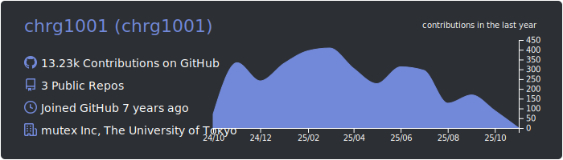
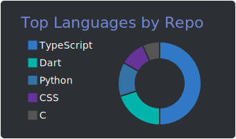
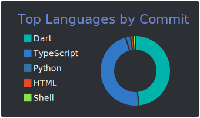
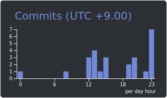

  
  
  
  

### Stats

 
 

### Contributions Graph

### Languages

  
  
  
  
  
  
  
  
  

### Libraries & Frameworks

  
  
  
  

### Infrastructures

  
  
  
  

### Trophy

### Public

 

